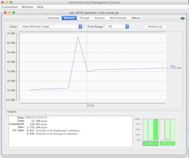
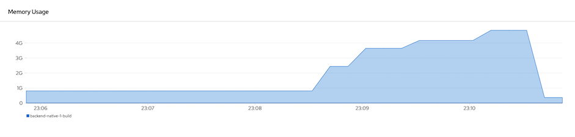

# Build Quarkus
```

    ____        _ __    __   ___        ____             __           
   / __ )__  __(_) /___/ /  ( _ )      / __ \___  ____  / /___  __  __
  / __  / / / / / / __  /  / __ \/|   / / / / _ \/ __ \/ / __ \/ / / /
 / /_/ / /_/ / / / /_/ /  / /_/  <   / /_/ /  __/ /_/ / / /_/ / /_/ / 
/_____/\__,_/_/_/\__,_/   \____/\/  /_____/\___/ .___/_/\____/\__, /  
                                              /_/            /____/   

```
- [Build Quarkus](#build-quarkus)
  - [JVM Mode](#jvm-mode)
    - [Fast JAR](#fast-jar)
      - [Startup Time and Memory Usage](#startup-time-and-memory-usage)
    - [Legacy JAR](#legacy-jar)
    - [Uber JAR](#uber-jar)
  - [Native Mode](#native-mode)
    - [Install and Configure GraalVM](#install-and-configure-graalvm)
    - [Build Native binary](#build-native-binary)
    - [Build Linux Native Binary](#build-linux-native-binary)
  - [Build Container Image](#build-container-image)
    - [JVM Mode](#jvm-mode-1)
      - [Dockerfile](#dockerfile)
    - [Native Mode](#native-mode-1)
      - [Dockerfile](#dockerfile-1)
    - [Build and push to external registry](#build-and-push-to-external-registry)
  - [OpenShift](#openshift)
    - [Source-to-Image Strategy](#source-to-image-strategy)
      - [JVM mode](#jvm-mode-2)
      - [Native mode](#native-mode-2)
      - [Push to external registry](#push-to-external-registry)
    - [OpenShift Extension](#openshift-extension)


## JVM Mode
### Fast JAR
* Build JAR is simple as simple maven project with **mvn package**. You need maven 3.6.2 or later for build quarkus
  - Build and package
  - 
    ```bash
    #package JAR
    cd code
    mvn clean package
    ```

  - Check for fast-jar under directory target/quarkus-app
  
    ```
    #Check quarkus-app under target directory for quarus-run.jar and libraries under lib
    ls target/quarkus-app/quarkus-run.jar
    ls target/quarkus-app/lib
    ```
    
  - Run

    ```bash
    java -jar target/quarkus-app/quarkus-run.jar
    ```

  - Run with environment variables
  
    ```bash
    java -Dapp.showResponse=true -Dapp.backend=https://httpbin.org/delay/3 -jar target/quarkus-app/quarkus-run.jar
    ```

  - Run with system environment variables
  
    ```bash
    #Use environment variable
    export APP_SHOWRESPONSE=true
    export APP_BACKEND=https://httpbin.org/delay/2
    java -jar  target/backend-1.0.0-runner.jar
    ```

  - Test with cURL
  
    ```bash
    curl http://localhost:8080/

    #OpenAPI docs
    curl -L http://localhost:8080/openapi
    curl -L http://localhost:8080/openapi?format=json

    #Get Metrics
    curl -L http://localhost:8080/metrics

    #Health Check
    curl -L http://localhost:8080/health

    #Health Check - Liveness
    curl -L http://localhost:8080/health/live

    #Health Check - Readiness
    curl -L http://localhost:8080/health/ready
    ```

#### Startup Time and Memory Usage
* Check Backend Application for elapsed time for start application. It took just **0.906** sec

  ```log
  08:34:00 INFO  [io.quarkus] (main) backend 1.0.0 on JVM (powered by Quarkus 1.12.0.Final) started in 1.084s. Listening on: http://0.0.0.0:8080
  08:34:00 INFO  [io.quarkus] (main) Profile prod activated.
  08:34:00 INFO  [io.quarkus] (main) Installed features: [cdi, kubernetes, resteasy, smallrye-health, smallrye-metrics, smallrye-openapi]
  ```
* Check for memory usage with **jconsole** and run load test with 10 concurrent requests.

  

* Check heap size with microprofiles metrics

  ```bash
  curl -L  -H"Accept: application/json" http://localhost:8080/metrics
  curl -L  http://localhost:8080/metrics
  #or
  curl -H"Accept: application/json" http://localhost:8080/q/metrics
  ```

  Sample output

  ```json
  {
      "base": {
          "cpu.systemLoadAverage": 7.02587890625,
          "thread.count": 30,
          "classloader.loadedClasses.count": 6121,
          "classloader.unloadedClasses.total": 0,
          "gc.total;name=G1 Young Generation": 6,
          "jvm.uptime": 474156,
          "thread.max.count": 38,
          "memory.committedHeap": 268435456,
          "classloader.loadedClasses.total": 6122,
          "cpu.availableProcessors": 4,
          "thread.daemon.count": 9,
          "gc.total;name=G1 Old Generation": 0,
          "memory.maxHeap": 4294967296,
          "cpu.processCpuLoad": 0.000417185512741686,
          "gc.time;name=G1 Old Generation": 0,
          "memory.usedHeap": 101828192,
          "gc.time;name=G1 Young Generation": 59
      },
      "vendor": {
          "memoryPool.usage.max;name=G1 Survivor Space": 6291456,
          "memory.freePhysicalSize": 197578752,
          "memoryPool.usage.max;name=CodeHeap 'non-profiled nmethods'": 3350400,
          "memoryPool.usage;name=Metaspace": 39884320,
          "memoryPool.usage;name=G1 Eden Space": 0,
          "memoryPool.usage;name=CodeHeap 'non-profiled nmethods'": 3350400,
          "memoryPool.usage;name=CodeHeap 'profiled nmethods'": 15034752,
          "memoryPool.usage;name=G1 Old Gen": 0,
          "memoryPool.usage.max;name=CodeHeap 'non-nmethods'": 1309952,
          "memoryPool.usage.max;name=G1 Old Gen": 13747808,
          "cpu.processCpuTime": 22003009000,
          "memory.committedNonHeap": 67313664,
          "memoryPool.usage.max;name=Compressed Class Space": 4250152,
          "memoryPool.usage.max;name=G1 Eden Space": 84934656,
          "memory.freeSwapSize": 1008730112,
          "memoryPool.usage.max;name=Metaspace": 39878096,
          "cpu.systemCpuLoad": 0.45880149812734083,
          "memory.usedNonHeap": 63789336,
          "memoryPool.usage;name=CodeHeap 'non-nmethods'": 1247232,
          "memoryPool.usage;name=G1 Survivor Space": 3145728,
          "memoryPool.usage;name=Compressed Class Space": 4250152,
          "memory.maxNonHeap": -1,
          "memoryPool.usage.max;name=CodeHeap 'profiled nmethods'": 15008512
      },
      "application": {
          "com.example.quarkus.BackendResource.countBackend": 1925,
          "com.example.quarkus.BackendResource.concurrentBackend": {
              "current": 0,
              "min": 0,
              "max": 0
          },
          "com.example.quarkus.BackendResource.timeBackend": {
              "p99": 851.840647,
              "min": 254.953659,
              "max": 1719.537727,
              "mean": 300.24028149427653,
              "p50": 271.035883,
              "p999": 1135.913466,
              "stddev": 102.52063708298743,
              "p95": 448.512492,
              "p98": 718.985401,
              "p75": 278.653653,
              "fiveMinRate": 2.2703813234668577,
              "fifteenMinRate": 1.6216041617988017,
              "meanRate": 4.065283396672213,
              "count": 1925,
              "oneMinRate": 0.16722634503546238
          }
      }
  }
  ```

### Legacy JAR
Legacy JAR is default package for Quarkus prior to 1.20

```bash
#package Uber JAR
cd code
mvn clean package \
-Dquarkus.package.type=legacy-jar

#Check for Uber JAR in target directory

#Remark that there is no directory lib
ls target/*-runner.jar
```

### Uber JAR

Uber jar can be build with  parameter **quarkus.package.uber-jar=true**

```bash
#package Uber JAR
cd code
mvn clean package \
-Dquarkus.package.type=uber-jar

#Check for Uber JAR in target directory

#Remark that there is no directory lib
ls target/*-runner.jar
```

## Native Mode

Quarkus 1.12 need need GraalVM vesion 21 to build native binary mode.

### Install and Configure GraalVM

* Download GraalVM & Untar it
  
```bash
export GRAALVM_VERSION=21.0.0.2
export JAVA_VERSION=java11

#Example for OSX
curl -o ~/Downloads/graalvm-ce-$JAVA_VERSION-darwin-amd64-$GRAALVM_VERSION.tar.gz \
-L https://github.com/graalvm/graalvm-ce-builds/releases/download/vm-$GRAALVM_VERSION/graalvm-ce-$JAVA_VERSION-darwin-amd64-$GRAALVM_VERSION.tar.gz
```

* Setup GRAALVM_HOME environment variable
  
```bash
#Sample for OSX
export GRAALVM_HOME=$HOME/opt/graalvm-ce-$JAVA_VERSION-$GRAALVM_VERSION/Contents/Home
```

* Install Native Image by *gu*

```bash
$GRAALVM_HOME/bin/gu install native-image
```

**Remark**: for OSX Catalina, you may need to run following command

```bash
sudo xattr -r -d com.apple.quarantine $HOME/opt/graalvm-ce-$JAVA_VERSION-$GRAALVM_VERSION
```

### Build Native binary

Native binary (native to your OS) can be build with parameter **-Pnative**

```bash
#Package
mvn clean package -Pnative -DskipTests=true

#Check for binary executable file
file target/backend-1.0.0-runner

#Sample Output on OSX
target/backend-1.0.0-runner: Mach-O 64-bit executable x86_64

#Run
target/backend-1.0.0-runner

#Then cURL
curl http://localhost:8080
```

You can use shell script *[build_native.sh](../code/build_native.sh)* to build native binary.

*Remark: You may need to set maximum memory of Docker to 5 GB*

Check Backend Application for elapsed time for start application. It took just **0.078s** sec

```log
09:10:09 INFO  [io.quarkus] (main) backend 1.0.0 native (powered by Quarkus 1.12.0.Final) started in 0.078s. Listening on: http://0.0.0.0:8080
09:10:09 INFO  [io.quarkus] (main) Profile prod activated.
09:10:09 INFO  [io.quarkus] (main) Installed features: [cdi, kubernetes, resteasy, smallrye-health, smallrye-metrics, smallrye-openapi]
```

### Build Linux Native Binary

Native binary for Container (Linux x64) can be build from your machine which may be not Linux by using parameter **-Dquarkus.native.container-build=true**
Build native container quite consume memory. You may need to configure maximum memory of your docker to 5GB

* Build container native binary with parameter **quarkus.native.container-build=true** 
  
  ```bash
  mvn clean package \
  -Dquarkus.native.container-build=true \
  -DskipTests=true \
  -Pnative
  ```
* Check for executable binary on linux format

  ```bash
  file target/backend-1.0.0-runner

  #Sample output
  target/backend-1.0.0-runner: ELF 64-bit LSB executable, x86-64, version 1 (SYSV), dynamically linked, interpreter /lib64/ld-linux-x86-64.so.2, for GNU/Linux 3.2.0, BuildID[sha1]=9658827db4fe64a490f8fafa42093da597bb3302, with debug_info, not stripped
  ```
* Build container image

  ```bash
  docker build -f src/main/docker/Dockerfile.native \
  -t backend-native:v1 .
  #Run
  docker run -p 8080:8080  backend-native:v1

  #Check
  docker images | head -n 2
  ``` 

## Build Container Image 

### JVM Mode

#### Dockerfile

* Build JAR
<!-- * Create *[.dockerignore](../code/.dockerignore)* to included JAR and lib in target directory.
  
```
*
!target/*-runner
!target/*-runner.jar
!target/lib/*
``` -->

* Build container image by using **[Dockerfile.jvm](../code/src/main/docker/Dockerfile.jvm)**
  
  ```bash
  docker build -f src/main/docker/Dockerfile.jvm \
  -t ${CONTAINER_NAME}:${TAG} .
  ```

* For uber jar, using [Dockerfile.jvm](../code/src/main/docker/Dockerfile.jvm)

  ```bash
  docker build -f src/main/docker/Dockerfile.jvm \
  -t ${CONTAINER_NAME}:${TAG} .
  ```

* Shell script to build JVM container [build_jvm_container.sh](../code/build_jvm_container.sh) and [build_jvm_uberjar_container.sh](../code/build_jvm_uberjar_container.sh)
  
* Test container
  
  ```bash
  #run container with port 8080
  docker run -p 8080:8080 ${CONTAINER_NAME}:${TAG} 

  #run container and pass environment variable 
  docker run -p 8080:8080 \
  -e app.showResponse=true \
  -e app.backend=https://httpbin.org/delay/1 \
  ${CONTAINERNAME}:${TAG}
  ```
  
#### JVM Mode with container-image-docker

* Quarkus provide Extension **container-image-docker** to build container image. (jib plugin also available). You can use **quarkus:add-extension** to add extension to *pom.xml*

  ```bash
  mvn quarkus:add-extension -Dextensions="container-image-docker"

  #Sample Output
  ✅ Adding extension io.quarkus:quarkus-container-image-docker
  [INFO] ------------------------------------------------------------------------
  [INFO] BUILD SUCCESS
  [INFO] ------------------------------------------------------------------------
  [INFO] Total time:  4.718 s
  [INFO] Finished at: 2020-04-11T19:15:21+07:00
  [INFO] ------------------------------------------------------------------------
  ```

* Behavior of plugin can be controlled by parmaeters. Following table depicts some of useful parameters. Check for Quarkus Document for full document. ()
  
| Parameter        | Description  | 
| ------------- |:-------------|
|quarkus.container-image.build | set to true to build image|
|quarkus.container-image.push| set to true to push image tor remote registry  | 
|quarkus.container-image.registry|  Remote container registry  |  
|quarkus.container-image.name| Image name. Default is name in pom.xml|
|quarkus.container-image.group|Group. Default is user name|
|quarkus.container-image.tag|Image tag. Default is version in pom.xml|


* Shell script **[build_jvm_container_by_plugin.sh](../code/build_jvm_container_by_plugin.sh)** to build Quarkus JVM container image and push image to remote registry.

Following script build container with name *backend* and push to *quay.io/voravitl/backend:v3*

```bash
PUSH_TO_REGISTRY=true
IMAGE_NAME=backend
IMAGE_GROUP=voravitl
IMAGE_TAG=v3
REGISTRY=quay.io
TEST=false
IMAGE_BUILD=true

# For JVM Mode
mvn clean package \
-Dquarkus.native.container-build=true \
-DSkipTests=${TEST} \
-Dquarkus.container-image.build=${IMAGE_BUILD} \
-Dquarkus.container-image.push=${PUSH_TO_REGISTRY} \
-Dquarkus.container-image.registry=${REGISTRY} \
-Dquarkus.container-image.name=${IMAGE_NAME} \
-Dquarkus.container-image.group=${IMAGE_GROUP} \
-Dquarkus.container-image.tag=${IMAGE_TAG}
```

<!-- ## Build Native Container Image 

* Build native container
* Create [.dockerignore](../code/.dockerignore) to included JAR and lib in target directory.
  
```
*
!target/*-runner
```

* Build container image by using **[Dockerfile.native](../code/src/main/docker/Dockerfile.native)**
  
```bash
docker build -f src/main/docker/Dockerfile.native \
-t ${CONTAINER_NAME}:${TAG} .
```

* Shell script to build JVM container [build_native_container.sh](../code/build_native_container.sh)
  
* Test container -->
### Native Mode

#### Dockerfile

Native binary for Container (Linux x64) can be build from your machine which may be not Linux by using parameter **-Dquarkus.native.container-build=true**
Build native container quite consume memory. You may need to configure maximum memory of your docker to 5GB
<!-- *Remark: Build container binary is quite CPU and also memory intensive. It will take some minutes to build* -->

* Build container native binary
  
  ```bash
  mvn clean package \
  -Dquarkus.native.container-build=true \
  -DskipTests=true \
  -Pnative
  ```
  
* Check for executable binary on linux format

```bash
file target/backend-1.0.0-runner

#Sample output
target/backend-1.0.0-runner: ELF 64-bit LSB executable, x86-64, version 1 (SYSV), dynamically linked, interpreter /lib64/ld-linux-x86-64.so.2, for GNU/Linux 3.2.0, BuildID[sha1]=9658827db4fe64a490f8fafa42093da597bb3302, with debug_info, not stripped
```
* Build container image by using **[Dockerfile.native](../code/src/main/docker/Dockerfile.native)**
  
```bash
docker build -f src/main/docker/Dockerfile.native \
-t ${CONTAINER_NAME}:${TAG} .
```
<!-- - Maven with option -Dnative-image.xmx=5g -->
<!-- - For Docker, configure maximum of Docker to 5 GB. Docker => Preference => Resources => Advance -->

<!-- ```bash
mvn clean package \
-Dquarkus.native.container-build=true \
-Pnative \
-DskipTests=true \
-Dnative-image.xmx=5g
``` -->
#### Native Mode with container-image-docker

* Just add **-Pnative** and use container-image-docker extension to build native container image.

  ```bash
  PUSH_TO_REGISTRY=true
  IMAGE_NAME=backend
  IMAGE_GROUP=voravitl
  IMAGE_TAG=v3
  REGISTRY=quay.io
  TEST=false
  IMAGE_BUILD=true

  # For Native Mode
  mvn clean package \
  -Dquarkus.native.container-build=true \
  -DSkipTests=${TEST} \
  -Pnative \
  -Dquarkus.container-image.build=${IMAGE_BUILD} \
  -Dquarkus.container-image.push=${PUSH_TO_REGISTRY} \
  -Dquarkus.container-image.registry=${REGISTRY} \
  -Dquarkus.container-image.name=${IMAGE_NAME} \
  -Dquarkus.container-image.group=${IMAGE_GROUP} \
  -Dquarkus.container-image.tag=${IMAGE_TAG}
  ```
  
  You can use shell script [build_native_container.sh](../code/build_native_container.sh) to build quarkus native container .
  
## OpenShift

Quarkus supported to build and deploy on OpenShift 

### Binary Build Strategy
* Build JAR 
* Create binary build and patch to change strategy to docker strategy

  ```bash
  oc new-build --binary --name=backend -l app=backend
  oc patch bc/backend -p "{\"spec\":{\"strategy\":{\"dockerStrategy\":{\"dockerfilePath\":\"src/main/docker/Dockerfile.jvm\"}}}}"
  ```

* Start build from current directory

  ```bash
  oc start-build backend --from-dir=. --follow
  ```

* Deploy Application

  ```bash
  oc new-app --image-stream=backend:latest
  ```

* (Optional) Pause deployment and set for liveness and readiness

  ```bash
  #Pause Rollout
  oc rollout pause deployment backend

  #Set Readiness Probe
  oc set probe deployment/backend --readiness --get-url=http://:8080/health/ready --initial-delay-seconds=15 --failure-threshold=1 --period-seconds=10

  #Set Liveness Probe
  oc set probe deployment/backend --liveness --get-url=http://:8080/health/live --initial-delay-seconds=10 --failure-threshold=3 --period-seconds=10
  ```

* (Optional) Set external configuration file. Quarkus will overwrite default configuration with configuration resides at *config/application.properites* relative to Quarkus binary or JAR directory.

  ```bash
  oc create configmap backend --from-file=config/application.properties
  oc set volume deployment/backend --add --name=backend-config \
  --mount-path=/deployments/config/application.properties \
  --sub-path=application.properties \
  --configmap-name=backend
  ```
  
* Expose service (create route) and resume rollout

  ```bash
  oc expose svc backend
  # or for route with TLS terminate at OpenShift router
  oc create route edge jackie --service=jackie --port=8080
  ```
* Resume rollout

  ```bash
  oc rollout resume dc backend
  BACKEND_URL=$(oc get route backend -o jsonpath='{.spec.host}')
  echo "Backend: http://$BACKEND_URL"
  ```

* All in one shell script, [build_ocp_jvm.sh](../code/build_ocp_jvm.sh)
<!-- * All in one shell script for Uber JAR, [build_ocp_jvm_uberjar.sh](../code/build_ocp_jvm_uberjar.sh) -->
### Build and push to external registry

* Create secret for access external registry
  
  ```bash
  PULL_SECRET_NAME=nexus-registry
  REGISTRY_SERVER=nexus-registry-ci-cd.apps.cluster-a987.a987.example.opentlc.com \
  USER=admin
  PASSWORD=<change this!>
  oc create secret docker-registry $PULL_SECRET_NAME \
      --docker-server=$REGISTRY_SERVER \
      --docker-username=$USER \
      --docker-password=$PASSWORD \
      --docker-email=unused
  ```
  
* Link secret to pod for pull image from external registry

  ```bash
  oc secrets link default nexus-registry --for=pull
  ```

* Build and push to external registry with parameter **--to-docker=true**

  * Create build config and specify secret in build config with parameter **--push-secert**
  
  ```bash
  NAME=backend
  TAG=latest
  oc new-build --binary --name=$NAME -l app=$NAME \
  --to-docker=true \
  --push-secret=nexus-registry \
  --to=nexus-registry-ci-cd.apps.cluster-a987.a987.example.opentlc.com/$NAME:$TAG
  oc patch bc/backend -p "{\"spec\":{\"strategy\":{\"dockerStrategy\":{\"dockerfilePath\":\"src/main/docker/Dockerfile.jvm\"}}}}"
  ```

  * Link secret to service account **builder**
    - Link secret
     
      ```bash
      oc secrets link builder nexus-registry
      ```
    - Create build config. There is no need to specify **--push-secert**
      
      ```bash
      NAME=backend
      TAG=latest
      oc new-build --binary --name=$NAME -l app=$NAME \
      --to-docker=true \
      --to=nexus-registry-ci-cd.apps.cluster-a987.a987.example.opentlc.com/$NAME:$TAG
      oc patch bc/backend -p "{\"spec\":{\"strategy\":{\"dockerStrategy\":{\"dockerfilePath\":\"src/main/docker/Dockerfile.jvm\"}}}}"
      ```

## OpenShift

### Source-to-Image Strategy

S2I support both JVM and native container. You need to specified which S2I to use for build Quarkus container

<!-- * Quarkus S2I need additional configuration in [.s2i/environment](../code/.s2i/environment)
* Build JVM container by following command or [build_jvm_s2i.sh](../code/build_jvm_s2i.sh) -->

#### JVM mode
You can use **oc new-app** to create container image and deploy to OpenShift from your source code in Git.

* Source-to-Image (S2I) use [.s2i/environment](../code/.s2i/environment) for build.
* Start build

  ```bash
  #Import openjdk-11 if you don't do this before
  oc import-image ubi8/openjdk-11 --from=registry.access.redhat.com/ubi8/openjdk-11 -n openshift --confirm

  #Set image builder and Git Repository URL
  APP_NAME=backend
  BASE_IMAGE=openjdk-11
  CONTEXT_DIR=code 
  APP_REPOSITORY=https://gitlab.com/ocp-demo/backend_quarkus.git

  #Use oc new-app to build and deploy
  oc new-app \
  ${BASE_IMAGE}~${APP_REPOSITORY} \
  --context-dir=${CONTEXT_DIR} \
  --build-env=QUARKUS_PACKAGE_TYPE=legacy-jar \
  --name=${APP_NAME}
  oc logs -f bc/${APP_NAME}
  ```
* Build with mirror repository
  
  ```bash
  oc new-app \
  ${BASE_IMAGE}~${APP_REPOSITORY} \
  --context-dir=${CONTEXT_DIR} \
  --build-env=QUARKUS_PACKAGE_TYPE=legacy-jar \
  --build-env=MAVEN_MIRROR_URL=http://nexus.ci-cd.svc.cluster.local:8081/repository/maven-all-public \
  --name=${APP_NAME}
  oc logs -f bc/${APP_NAME}
  ```

 #### Native mode
* Check [application.properties](../code/src/main/resources/application.properties) for max heap size of for build native image or pass environment variable **QUARKUS_NATIVE_NATIVE-IMAGE-XMX** with build
  
  ```properties
  # Set maximum memory for build native
  quarkus.native.native-image-xmx=4096m
  ```
  
* Build Native container by following command or use shell [build_native_s2i.sh](../code/build_jvm_container_by_plugin.sh)

  ```bash
  #Set image builder and Git Repository URL
  APP_NAME=backend-native
  BASE_IMAGE=quay.io/quarkus/ubi-quarkus-native-s2i:21.0.0.2-java11
  CONTEXT_DIR=code 
  APP_REPOSITORY=https://gitlab.com/ocp-demo/backend_quarkus.git

  #Use oc new-app to build 
  #Optional MAVEN_MIRROR_URL  quarkus.native.native-image-xmx=4096m
  oc new-app \
  ${BASE_IMAGE}~${APP_REPOSITORY} \
  --context-dir=${CONTEXT_DIR} \
  --build-env=QUARKUS_NATIVE_NATIVE-IMAGE-XMX=4096m \
  --name=${APP_NAME}

  # Set max heap size of build pod to 5 GB
  oc patch bc/backend-native -p '{"spec":{"resources":{"limits":{"cpu":"4", "memory":"5Gi"}}}}'
  oc get build
  oc logs -f bc/${APP_NAME}
  ```
  
* Memory used by build pod

  

 #### Push to external registry
 * Create [secret](#push-to-external-registry)
 * Link service account [builder to secret](#push-to-external-registry)
 * Patch build config after run **oc new-app**
  
  ```bash
  APP_NAME=backend
  BASE_IMAGE=openjdk-11
  CONTEXT_DIR=code
  TAG=latest
  REGISTRY=nexus-registry-ci-cd.apps.cluster-a987.a987.example.opentlc.com 
  APP_REPOSITORY=https://gitlab.com/ocp-demo/backend_quarkus.git
  
  oc new-app \
  $BASE_IMAGE~$APP_REPOSITORY \
  --context-dir=$CONTEXT_DIR \
  --build-env=QUARKUS_PACKAGE_TYPE=legacy-jar \
  --build-env=MAVEN_MIRROR_URL=http://nexus.ci-cd.svc.cluster.local:8081/repository/maven-all-public \
  --name=$APP_NAME
  
  # Stop build
  oc delete build $APP_NAME-1
  
  # Patch build config to push image to external registry
  oc patch bc/$APP_NAME -p "{\"spec\":{\"output\":{\"to\":{\"kind\":\"DockerImage\"}}}}"
  oc patch bc/$APP_NAME -p "{\"spec\":{\"output\":{\"to\":{\"name\":\"nexus-registry-ci-cd.apps.cluster-a987.a987.example.opentlc.com/backend:v1\"}}}}"
  
  # Patch deployment
  oc patch deployment backend --type='json' -p='[{"op":"replace","path":"/spec/template/spec/containers/0/image","value":"'$REGISTRY'/'$APP_NAME':'$TAG'"}]'

  # Start build
  oc start-build $APP_NAME
  oc logs -f bc/$APP_NAME
  ```
### OpenShift Extension

* add openshift extension
  
  ```bash
  mvn quarkus:add-extension -Dextensions="openshift"

  #Sample output
  ✅ Extension io.quarkus:quarkus-openshift has been installed
  [INFO] ------------------------------------------------------------------------
  [INFO] BUILD SUCCESS
  [INFO] ------------------------------------------------------------------------
  [INFO] Total time:  8.607 s
  [INFO] Finished at: 2021-03-09T16:18:04+07:00
  [INFO] ------------------------------------------------------------------------
  ```
  *Remark: Extension container-image-docker cannot be installed at the same time with extension openshift.*
  
  To remove extension. Run following command
  
  ```bash
  mvn quarkus:remove-extension -Dextensions="quarkus-container-image-docker"
  ```
   
* Build with S2I
  - Build with openshift plugin. This will create build config and imagestream with tag by version specified in pom.xml
  
    ```bash
    mvn clean package \
    -Dquarkus.package.type=legacy-jar \
    -Dquarkus.kubernetes-client.trust-certs=true \
    -Dquarkus.container-image.build=true \
    -DskipTests=true

    # Check result
    oc get is
    oc get bc
    oc get build
    ``` 

  - Deploy application from imagestream
  
   ```bash
   oc new-app --name=backend backend:1.0.0
   ``` 

  <!-- - Create and deploy in single step with paramter **quarkus.kubernetes.deploy=true**
    
    **Remark**: Use quarkus.openshift.expose=true to automatically create route
    
    ```bash
    mvn clean package \
    -Dquarkus.package.type=legacy-jar \
    -Dquarkus.kubernetes-client.trust-certs=true \
    -Dquarkus.container-image.build=true \
    -Dquarkus.kubernetes.deploy=true \
    -Dquarkus.openshift.expose=true \
    -Dquarkus.openshift.labels.app=backend \
    -Dquarkus.openshift.labels.version=1.0.0 \
    -Dquarkus.openshift.labels."app.openshift.io/runtime"=quarkus \
    -DskipTests=true
    ``` -->
<!-- ### Quarkus Extensions

Quarkus support for automatic deployment to kubernetes, OpenShift (and KNative)
- quarkus-kubernetes
- quarkus-kubernetes-client
- quarkus-openshift

Following show sample configuration in application.properties
```properties

# Kubernetes plugin
quarkus.kubernetes.deployment-target=openshift
quarkus.openshift.part-of=demo
quarkus.kubernetes-client.trust-certs=true
quarkus.openshift.labels.app=backend
quarkus.openshift.replicas=2
quarkus.openshift.expose=true

# Traditional JAR
quarkus.package.type=legacy-jar
```
Deploy with following command

```bash
mvn clean package -Dquarkus.kubernetes.deploy=true
```  -->