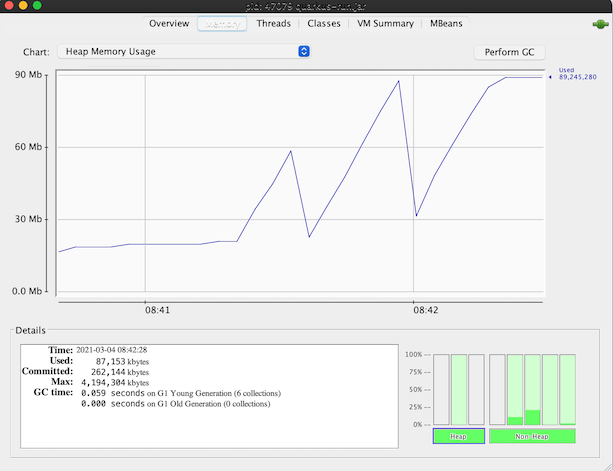

# Build Quarkus
```

    ____        _ __    __   ___        ____             __           
   / __ )__  __(_) /___/ /  ( _ )      / __ \___  ____  / /___  __  __
  / __  / / / / / / __  /  / __ \/|   / / / / _ \/ __ \/ / __ \/ / / /
 / /_/ / /_/ / / / /_/ /  / /_/  <   / /_/ /  __/ /_/ / / /_/ / /_/ / 
/_____/\__,_/_/_/\__,_/   \____/\/  /_____/\___/ .___/_/\____/\__, /  
                                              /_/            /____/   

```
<!-- TOC -->

- [Build Quarkus](#build-quarkus)
  - [Build Java Application](#build-java-application)
    - [JAR](#jar)
    - [Startup Time and Memory Usage](#startup-time-and-memory-usage)
    - [Uber JAR](#uber-jar)
  - [Build Native Application](#build-native-application)
    - [Install and Configure GraalVM](#install-and-configure-graalvm)
    - [Build Native binary](#build-native-binary)
    - [Build Native Container Binary](#build-native-container-binary)
  - [Build JVM Container Image](#build-jvm-container-image)
    - [Dockerfile](#dockerfile)
    - [Quarkus Extension](#quarkus-extension)
  - [Build Native Container Image](#build-native-container-image)
  - [Deploy on OpenShift](#deploy-on-openshift)
    - [Binary Build Strategy](#binary-build-strategy)
    - [Source-to-Image Strategy](#source-to-image-strategy)
    - [Quarkus Extensions](#quarkus-extensions)

<!-- /TOC -->


## Build Java Application

### JAR

Build JAR is simple as simple maven project with **mvn package**
Ramark that *Quarkus 1.3.2.Final needs maven 3.6.3+* 

```bash
#package JAR
cd code
mvn clean package

#Check target directory for *-runner.jar and Java classes in lib directory
ls target/*.jar
ls target/lib

#Run
java -jar target/backend-1.0.0-runner.jar

#Remark: Check that how fast it is!
#Test environment variables
java -Dapp.showResponse=true -Dapp.backend=https://httpbin.org/delay/2 -jar target/backend-1.0.0-runner.jar

#Use environment variable
export APP_SHOWRESPONSE=true
export APP_BACKEND=https://httpbin.org/delay/2
java -jar  target/backend-1.0.0-runner.jar

#Test by cURL
curl http://localhost:8080/

#OpenAPI docs
curl http://localhost:8080/openapi

#Get Metrics
curl http://localhost:8080/metrics

#Health Check
curl http://localhost:8080/health

#Health Check - Liveness
curl http://localhost:8080/health/liveness

#Health Check - Readiness
curl http://localhost:8080/health/readiness
```

### Startup Time and Memory Usage
Check Backend Application for elapsed time for start application. It took just **0.906** sec

```log
22:43:28 INFO  [io.quarkus] (main) backend 1.0.0 (powered by Quarkus 1.3.2.Final) started in 0.906s. Listening on: http://0.0.0.0:8080
22:43:28 INFO  [io.quarkus] (main) Profile prod activated.
22:43:28 INFO  [io.quarkus] (main) Installed features: [cdi, kubernetes, resteasy, smallrye-health, smallrye-metrics, smallrye-openapi]
```
Check for memory usage with **jconsole** and run load test with 10 concurrent requests.



You can also use Microprofile metrics to check for heap size. ( /metrics)
```json
{
    "base": {
        "gc.total;name=PS MarkSweep": 1,
        "cpu.systemLoadAverage": 3.69921875,
        "thread.count": 27,
        "classloader.loadedClasses.count": 4421,
        "classloader.unloadedClasses.total": 14,
        "gc.total;name=PS Scavenge": 4,
        "gc.time;name=PS MarkSweep": 24,
        "jvm.uptime": 55038,
        "thread.max.count": 30,
        "memory.committedHeap": 153616384,
        "classloader.loadedClasses.total": 4435,
        "cpu.availableProcessors": 4,
        "gc.time;name=PS Scavenge": 49,
        "thread.daemon.count": 15,
        "memory.maxHeap": 3817865216,
        "cpu.processCpuLoad": 0.06357645696526383,
        "memory.usedHeap": 32171864
    },
    "vendor": {
        "memory.freePhysicalSize": 167227392,
        "memoryPool.usage;name=Metaspace": 26855208,
        "memoryPool.usage.max;name=PS Eden Space": 67108864,
        "memoryPool.usage;name=PS Eden Space": 0,
        "memoryPool.usage.max;name=PS Old Gen": 9774296,
        "memoryPool.usage;name=PS Old Gen": 7849952,
        "cpu.processCpuTime": 10158221000,
        "memory.committedNonHeap": 44892160,
        "memoryPool.usage.max;name=PS Survivor Space": 11009016,
        "memoryPool.usage.max;name=Compressed Class Space": 3069176,
        "memoryPool.usage;name=Code Cache": 13323520,
        "memory.freeSwapSize": 168620032,
        "memoryPool.usage.max;name=Metaspace": 26855208,
        "cpu.systemCpuLoad": 0.3891074394614914,
        "memoryPool.usage.max;name=Code Cache": 13330496,
        "memory.usedNonHeap": 43247904,
        "memoryPool.usage;name=PS Survivor Space": 11009016,
        "memoryPool.usage;name=Compressed Class Space": 3069176,
        "memory.maxNonHeap": -1
    },
    "application": {
        "com.example.quarkus.BackendResource.countBackend": 690,
        "com.example.quarkus.BackendResource.timeBackend": {
            "p99": 1690.584713,
            "min": 265.280565,
            "max": 2285.616676,
            "mean": 379.13525211755694,
            "p50": 277.785304,
            "p999": 2285.616676,
            "stddev": 274.5684725716509,
            "p95": 900.826063,
            "p98": 997.362297,
            "p75": 307.125509,
            "fiveMinRate": 1.671313376057565,
            "fifteenMinRate": 0.570043086274094,
            "meanRate": 12.493649417000773,
            "count": 681,
            "oneMinRate": 7.310831119254727
        }
    }
}
```


### Uber JAR

Uber jar can be build with  parameter **quarkus.package.uber-jar=true**

```bash
#package Uber JAR
cd code
mvn clean package \
-Dquarkus.package.uber-jar=true

#Check for Uber JAR in target directory

#Remark that there is no directory lib
ls target/*.jar
```

## Build Native Application

For build binary application you need GraalVM vesion 19.3.1 or 20.0.0. For OSX user, you also need XCode.

### Install and Configure GraalVM

* Download GraalVM & Untar it
  
```bash
export GRAALVM_VERSION=19.3.1
export JAVA_VERSION=java8

#Example for OSX
curl -o ~/Downloads/graalvm-ce-${JAVA_VERSION}-darwin-amd64-${GRAALVM_VERSION}.tar.gz \
-L https://github.com/graalvm/graalvm-ce-builds/releases/download/vm-${GRAALVM_VERSION}/graalvm-ce-${JAVA_VERSION}-darwin-amd64-${GRAALVM_VERSION}.tar.gz
```

* Setup GRAALVM_HOME environment variable
  
```bash
#Sample for OSX
export GRAALVM_HOME=${HOME}/opt/graalvm-ce-${JAVA_VERSION}-${GRAALVM_VERSION}/Contents/Home
```

* Install Native Image by *gu*

```bash
${GRAALVM_HOME}/bin/gu install native-image
```

**Remark**: for OSX Catalina, you may need to run following command

```bash
sudo xattr -r -d com.apple.quarantine <path-to-graal>/graalvm-ce-java11-20.0.0
```

### Build Native binary

Native binary (native to your OS) can be build with parameter **-Pnative**

```bash
#Package
mvn clean package -Pnative -DskipTests=true

#Run
target/backend-1.0.0-runner

#Then cURL
curl -v http://localhost:8080
```

You can use shell script *[build_native.sh](../code/build_native.sh)* to build native binary.

Check Backend Application for elapsed time for start application. It took just **0.044s** sec

```log
22:51:03 INFO  [io.quarkus] (main) backend 1.0.0 (powered by Quarkus 1.3.2.Final) started in 0.044s. Listening on: http://0.0.0.0:8080
22:51:03 INFO  [io.quarkus] (main) Profile prod activated.
22:51:03 INFO  [io.quarkus] (main) Installed features: [cdi, kubernetes, resteasy, smallrye-health, smallrye-metrics, smallrye-openapi]
```

### Build Native Container Binary

Native binary for Container (Linux x64) can be build from your machine which may be not Linux by using parameter **-Dquarkus.native.container-build=true**

*Remark: Build container binary is quite CPU and also memory intensive. It will take some minutes to build*

```bash
mvn clean package \
-Dquarkus.native.container-build=true \
-DskipTests=true \
-Pnative
```

Build native container quite consume memory. You may need to configure maximum memory limits at
- Maven with option -Dnative-image.xmx=5g
- For Docker, configure maximum of Docker to 8 GB. Docker => Preference => Resources => Advance

```bash
mvn clean package \
-Dquarkus.native.container-build=true \
-Pnative \
-DskipTests=true \
-Dnative-image.xmx=5g
```

You can use shell script [build_native_container.sh](../code/build_native_container.sh) to build native  container binary.

## Build JVM Container Image 

### Dockerfile

* Build JAR
* Create *[.dockerignore](../code/.dockerignore)* to included JAR and lib in target directory.
  
```
*
!target/*-runner
!target/*-runner.jar
!target/lib/*
```

* Build container image by using **[Dockerfile.jvm](../code/src/main/docker/Dockerfile.jvm)**
  
```bash
docker build -f src/main/docker/Dockerfile.jvm \
-t ${CONTAINER_NAME}:${TAG} .
```

* For uber jar, using [Dockerfile.jvm_uberjar](../code/src/main/docker/Dockerfile.jvm_uberjar)

```bash
docker build -f src/main/docker/Dockerfile.jvm_uberjar \
-t ${CONTAINER_NAME}:${TAG} .
```

* Shell script to build JVM container [build_jvm_container.sh](../code/build_jvm_container.sh) and [build_jvm_uberjar_container.sh](../code/build_jvm_uberjar_container.sh)
  
* Test container
  
```bash
#run container with port 8080
docker run -p 8080:8080 ${CONTAINER_NAME}:${TAG} 

#run container and pass environment variable 
docker run -p 8080:8080 \
-e app.showResponse=true \
-e app.backend=https://httpbin.org/delay/1 \
${CONTAINERNAME}:${TAG}
```

### Quarkus Extension

* Quarkus provide Extension **container-image-docker** to build container image. ( jib plugin also available). You can use **quarkus:add-extension** to add extension to *pom.xml*

```bash
mvn quarkus:add-extension -Dextensions="container-image-docker"

#Sample Output
✅ Adding extension io.quarkus:quarkus-container-image-docker
[INFO] ------------------------------------------------------------------------
[INFO] BUILD SUCCESS
[INFO] ------------------------------------------------------------------------
[INFO] Total time:  4.718 s
[INFO] Finished at: 2020-04-11T19:15:21+07:00
[INFO] ------------------------------------------------------------------------
```

* Behavior of plugin can be controlled by parmaeters. Following table depicts some of useful parameters. Check for Quarkus Document for full document. ()
  
| Parameter        | Description  | 
| ------------- |:-------------|
|quarkus.container-image.build | set to true to build image|
|quarkus.container-image.push| set to true to push image tor remote registry  | 
|quarkus.container-image.registry|  Remote container registry  |  
|quarkus.container-image.name| Image name. Default is name in pom.xml|
|quarkus.container-image.group|Group. Default is user name|
|quarkus.container-image.tag|Image tag. Default is version in pom.xml|


* Shell script **[build_jvm_container_by_plugin.sh](../code/build_jvm_container_by_plugin.sh)** to build Quarkus JVM container image and push image to remote registry.

Following script build container with name *backend* and tag with *v3* and push to *quay.io/voravitl/backend*

```bash
#!/bin/sh
PUSH_TO_REGISTRY=true
IMAGE_NAME=backend
IMAGE_GROUP=voravitl
IMAGE_TAG=v3
REGISTRY=quay.io
TEST=false
IMAGE_BUILD=true

#mvn quarkus:add-extension -Dextensions="container-image-docker"
mvn clean package \
-Dquarkus.native.container-build=true \
-DSkipTests=${TEST} \
-Dquarkus.container-image.build=${IMAGE_BUILD} \
-Dquarkus.container-image.push=${PUSH_TO_REGISTRY} \
-Dquarkus.container-image.registry=${REGISTRY} \
-Dquarkus.container-image.name=${IMAGE_NAME} \
-Dquarkus.container-image.group=${IMAGE_GROUP} \
-Dquarkus.container-image.tag=${IMAGE_TAG}
```

## Build Native Container Image 

* Build native container
* Create [.dockerignore](../code/.dockerignore) to included JAR and lib in target directory.
  
```
*
!target/*-runner
```

* Build container image by using **[Dockerfile.native](../code/src/main/docker/Dockerfile.native)**
  
```bash
docker build -f src/main/docker/Dockerfile.native \
-t ${CONTAINER_NAME}:${TAG} .
```

* Shell script to build JVM container [build_native_container.sh](../code/build_native_container.sh)
  
* Test container

## Deploy on OpenShift

### Binary Build Strategy
* Build JAR (or Uber JAR)
* Create binary build and patch to change strategy to docker strategy

```bash
oc new-build --binary --name=backend -l app=backend
oc patch bc/backend -p "{\"spec\":{\"strategy\":{\"dockerStrategy\":{\"dockerfilePath\":\"src/main/docker/Dockerfile.jvm\"}}}}"
```

* Start build from current directory

```bash
oc start-build backend --from-dir=. --follow
```

* Deploy Application

```bash
oc new-app --image-stream=backend:latest
```

* (Optional) Pause deployment and set for liveness and readiness

```bash
#Pause Rollout
oc rollout pause dc backend

#Set Readiness Probe
oc set probe dc/backend --readiness --get-url=http://:8080/health/ready --initial-delay-seconds=15 --failure-threshold=1 --period-seconds=10

#Set Liveness Probe
oc set probe dc/backend --liveness --get-url=http://:8080/health/live --initial-delay-seconds=10 --failure-threshold=3 --period-seconds=10
```

* (Optional) Set external configuration file. Quarkus will overwrite default configuration with configuration resides at *config/application.properites* relative to Quarkus binary or JAR directory.

```bash
oc create configmap backend --from-file=manifests/application.properties
oc set volume dc/backend --add --name=backend-config \
--mount-path=/deployments/config/application.properties \
--sub-path=application.properties \
--configmap-name=backend

```
* Expose service (create route) and resume rollout

```bash
oc expose svc backend
oc rollout resume dc backend
BACKEND_URL=$(oc get route backend -o jsonpath='{.spec.host}')
echo "Backend: http://$BACKEND_URL"
```

* All in one shell script, [build_ocp_jvm.sh](../code/build_ocp_jvm.sh)
* All in one shell script for Uber JAR, [build_ocp_jvm_uberjar.sh](../code/build_ocp_jvm_uberjar.sh)
  
### Source-to-Image Strategy

S2I support both JVM and native container. You need to specified which S2I to use for build Quarkus container

* Quarkus S2I need additional configuration in [.s2i/environment](../code/.s2i/environment)
* Build JVM container by following command or [build_jvm_s2i.sh](../code/build_jvm_s2i.sh)

```bash
#Set image builder and Git Repository URL
APP_NAME=backend
BASE_IMAGE=registry.access.redhat.com/redhat-openjdk-18/openjdk18-openshift
CONTEXT_DIR=code 
APP_REPOSITORY=https://gitlab.com/ocp-demo/backend_quarkus.git

#Use oc new-app to build
oc new-app \
${BASE_IMAGE}~${APP_REPOSITORY} \
--context-dir=${CONTEXT_DIR} \
--name=${APP_NAME}
```

* Build Native container by following command or use shell [build_native_s2i.sh](../code/build_jvm_container_by_plugin.sh)

```bash
#Set image builder and Git Repository URL
APP_NAME=backend-native
BASE_IMAGE=quay.io/quarkus/ubi-quarkus-native-s2i:19.3.1-java8
CONTEXT_DIR=code 
APP_REPOSITORY=https://gitlab.com/ocp-demo/backend_quarkus.git

#Use oc new-app to build
oc new-app \
${BASE_IMAGE}~${APP_REPOSITORY} \
--context-dir=${CONTEXT_DIR} \
--name=${APP_NAME}
```

### Quarkus Extensions

Quarkus support for automatic deployment to kubernetes, OpenShift (and KNative)
- quarkus-kubernetes
- quarkus-kubernetes-client
- quarkus-openshift

Following show sample configuration in application.properties
```properties
quarkus.kubernetes.deployment-target=openshift
quarkus.openshift.part-of=demo
quarkus.kubernetes-client.trust-certs=true
quarkus.openshift.labels.app=greeting
quarkus.openshift.replicas=2
quarkus.openshift.expose=true
```
Deploy with following command
```bash
mvn clean package -Dquarkus.kubernetes.deploy=true
```