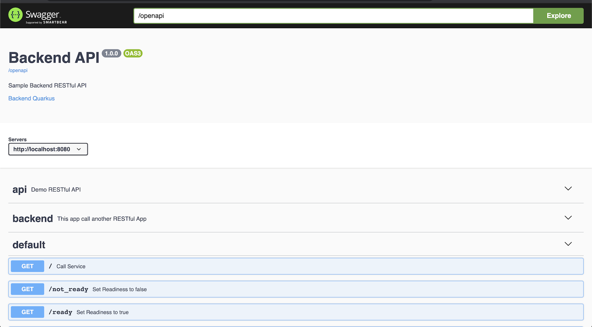

# Backend Application
```
   ____                   __             
  / __ \__  ______ ______/ /____  _______
 / / / / / / / __ `/ ___/ //_/ / / / ___/
/ /_/ / /_/ / /_/ / /  / ,< / /_/ (__  ) 
\___\_\__,_/\__,_/_/  /_/|_|\__,_/____/  
```
<!-- TOC -->

- [Backend Application](#backend-application)
  - [Overview](#overview)
    - [Application Config](#application-config)
    - [URI Supported by](#uri-supported-by)
  - [Start Coding with Quarkus](#start-coding-with-quarkus)
    - [Development Mode](#development-mode)
    - [Unit Test](#unit-test)
  - [Configuration Properties](#configuration-properties)
  - [MicroProfile  Health Check](#microprofile-health-check)
  - [MicroProfile OpenAPI](#microprofile-openapi)
  - [MicroProfile Metrics](#microprofile-metrics)
  - [Logging](#logging)
    - [Logging Banner](#logging-banner)

<!-- /TOC -->

## Overview

Simple RESTful Application that call another service via HTTP GET method with following features:

* RESTful API with RestEasy
* Configuration file and environment variables
* MicroProfile  Health Check
* MicroProfile OpenAPI
* MicroProfile Metrics

### Application Config

|Variable|Description|Default Value| 
| ------------- |:-------------|:----------|
|app.version|Application Version|1.0.0| 
|app.backend|target URL that backend request to|http://localhost:8080/version| 
|app.message|Message return from application|Hello, World| 
|app.showResponse|Show response from app.backend instead of app.message|false| 
|app.errorCodeNotLive|Return Code when liveness is false|504| 
|app.errorCodeNotReady|Return Code when readiness is false|503| 

### URI Supported by 

| URI        | Description  | 
| ------------- |:-------------|
|/|Return Hello Message|
|/health/live|Livenness probe URL|
|/health/ready|Readiness probe URL|
|/stop|Set liveness to false|
|/start|Set liveness to true|
|/not_ready|Set readiness to false|
|/ready|Set readiness to true|
|/version|Return App version|
|/openapi|Return OpenAPI (Swagger) document in yaml |
|/openapi?format=json|Return OpenAPI (Swagger) document in JSON |
|metrics/application|get metrics data|


## Start Coding with Quarkus
* Try [code.quarkus.org](https://code.quarkus.org) for bootstrap and discovers its extension
* Development mode. Quarkus comes with development mode which support live reload. The Changes are automatically reloaded when you update codes and configurations.

### Development Mode
Quarkus support development mode. This support for backgroud compilation for hot deployment.

With development mode. You can start development mode. When you modify your java files and/or cofiguration file. Those changes will automatically effect.
Reload brower (or call you applicaton with cRUL or other tools) java files are recompiled and deployed.
```bash
mvn quarkus:dev
```

### Unit Test
```bash
mvn test
mvn test -Dquarkus.test.profile=dev
```

## Configuration Properties
* Quarkus uses MicroProfile Config to inject by *@ConfigurationProperty* annotation.
```java
public class BackendResource {
    @ConfigProperty(name = "app.version", defaultValue = "1.0.0")
    String version;

    @ConfigProperty(name = "app.backend", defaultValue = "http://localhost:8080/version")
    String backend;

    @ConfigProperty(name = "app.message", defaultValue = "Hello, World")
    String message;

    @ConfigProperty(name = "app.errorCodeNotLive", defaultValue = "503")
    String errorCodeNotLive;

    @ConfigProperty(name = "app.errorCodeNotReady", defaultValue = "504")
    String errorCodeNotReady;

    @ConfigProperty(name = "app.showResponse", defaultValue = "true")
    String showResponse;
    
    // Some code here
}
```
* Configuration precedence from lowest to highest
  - src/main/resources/META-INF/application.properties
  - Environment variable. Remark that app.version is same as APP_VERSION
  - application.properties file store under directory /config relative path to application JAR or binary


## MicroProfile  Health Check
* Add Microprofile Health extension
```bash
mvn quarkus:add-extension -Dextensions="health"
```
* Health check URIs 
  - /health 
  - /health/live
  - /health/ready 

* Custom Liveness health check ([AppLiveness.java](../code/src/main/java/com/example/quarkus/health/AppLiveness.java))
```java
@Liveness
@ApplicationScoped
public class AppLiveness implements HealthCheck {

    @Override
    public HealthCheckResponse call() {
        if (ApplicationConfig.IS_ALIVE.get())
            return HealthCheckResponse.up("Live");
        else
            return HealthCheckResponse.down("Live");
    }
}
```
* Custom Readiness health check ([AppReadiness.java](../code/src/main/java/com/example/quarkus/health/AppReadiness.java))
```java
@Readiness
@ApplicationScoped
public class AppReadiness implements HealthCheck {
    @Override
    public HealthCheckResponse call() {
        if (ApplicationConfig.IS_READY.get())
            return HealthCheckResponse.up("Ready");
        else
            return HealthCheckResponse.down("Ready");
    }
}
```
* Test health check by start quarkus in development mode 
```bash
mvn quarkus:dev
```
* Call health check for both liveness and readiness by using /health, /health/live and /health/ready
```bash
curl http://localhost:8080/health
curl http://localhost:8080/health/live
curl http://localhost:8080/health/ready
```
* Sample out from /health/ready
```json
  {
    "status": "UP",
    "checks": [
        {
            "name": "Ready",
            "status": "UP"
        }
    ]
}
```

## MicroProfile OpenAPI
* Add Microprofile OpenAPI extension
```bash
mvn quarkus:add-extension -Dextensions="openapi"
```

* Annotate API information for method level.(*[BackendResource.java](../code/src/main/java/com/example/quarkus/BackendResource.java)*)
```java
    @GET
    @Path("/")
    @Produces(MediaType.TEXT_PLAIN)
    @Operation(summary = "Call Service")
    @APIResponse(responseCode = "200", content = @Content(mediaType = MediaType.TEXT_PLAIN))
    public Response callBackend() throws IOException {
         // Some Code Here...
    }
```

* Create JAX-RS Application class for annotate global API information. Remark that JAX-RS Application class is not needed for Quarkus. (*[BackendApp.class](../code/src/main/java/com/example/quarkus/BackendApp.java)*)
```java
@ApplicationPath("/")
@OpenAPIDefinition(
    info = @Info(title = "Backend API",
        description = "Sample Backend RESTful API",
        version = "1.0.0",
        contact = @Contact(name = "Voraviz", url = "")),
    servers = {
        @Server(url = "http://localhost:8080")
    },
    externalDocs = @ExternalDocumentation(url = "https://gitlab.com/ocp-demo/backend_quarkus", description = "Backend Quarkus"),
    tags = {
        @Tag(name = "api", description = "Demo RESTful API"),
        @Tag(name = "backend", description = "This app call another RESTful App")
    }
)
public class BackendApp extends Application {

}
```

* Default URI for OpenAPI is */openapi*. This can be changed by setting parameter *quarkus.smallrye-openapi.path* in *[application.properties](../code/src/main/resources/application.properties)*
```properties
quarkus.smallrye-openapi.path=/openapi
```
* Test access to swagger-ui by run quarkus in developer mode using **quarkus:dev**
```bash
mvn quarkus:dev
# Use browser connect to http://127.0.0.1/swagger-ui
```

Swagger UI page



* By default, Swagger UI is included in development mode only. If you want swagger UI in your deployment. Update *quarkus.swagger-ui.always-include* to *true* in  *[application.properties](../code/src/main/resources/application.properties)*
```properties
quarkus.swagger-ui.always-include=true
```

## MicroProfile Metrics
* Add Microprofile metrics extension
```bash
mvn quarkus:add-extension -Dextensions="metrics"
```
* Annotate REST method with *@Counted* and *@Timed* (*[BackendResource.java](../code/src/main/java/com/example/quarkus/BackendResource.java)*)
```java
    @Counted(
        name = "countBackend", 
        description = "Counts how many times the backend method has been invoked"
        )
    @Timed(
        name = "timeBackend", 
        description = "Times how long it takes to invoke the backend method", 
        unit = MetricUnits.MILLISECONDS
        )
    public Response callBackend() throws IOException {
        // Some Code Here...
    }
```
* URI for get metrics data
  - /metrics - all metrics data
  - /metrics/application - only application data (from annotated to code)
  - Add header "Accept: application/json" if you want response in JSON format.
* (Optional) Setup Prometheus and Grafana for monitor application metrics. Click **[here](METRICS.md)**
* You can test by start quarkus in development mode with **quarkus:dev** then use another termial to call to URI */* then check metrics with */metrics/application*
  ```bash
  #start development mode
  mvn quarkus:dev
  #At another terminal/sheel
  curl http://localhost:8080/
  #Check for metrics
  curl -H "Accept: application/json" http://localhost:8080/metrics/application
  ```
* Metrics will show that *com.example.quarkus.BackendResource.countBackend* is 1
```json
  {
    "com.example.quarkus.BackendResource.countBackend": 1,
    "com.example.quarkus.BackendResource.timeBackend": {
        "p99": 1655.201434,
        "min": 1655.201434,
        "max": 1655.201434,
        "mean": 1655.201434,
        "p50": 1655.201434,
        "p999": 1655.201434,
        "stddev": 0.0,
        "p95": 1655.201434,
        "p98": 1655.201434,
        "p75": 1655.201434,
        "fiveMinRate": 0.18710139700632353,
        "fifteenMinRate": 0.19560457449692012,
        "meanRate": 0.03751145477260077,
        "count": 1,
        "oneMinRate": 0.1433062621147579
    }
}
```
* Metrics for CPU and Memory utilization also provided by metrics. This provided by access to URI /metrics
```json
{
    "base": {
        "gc.total;name=PS MarkSweep": 1,
        "cpu.systemLoadAverage": 3.69921875,
        "thread.count": 27,
        "classloader.loadedClasses.count": 4421,
        "classloader.unloadedClasses.total": 14,
        "gc.total;name=PS Scavenge": 4,
        "gc.time;name=PS MarkSweep": 24,
        "jvm.uptime": 55038,
        "thread.max.count": 30,
        "memory.committedHeap": 153616384,
        "classloader.loadedClasses.total": 4435,
        "cpu.availableProcessors": 4,
        "gc.time;name=PS Scavenge": 49,
        "thread.daemon.count": 15,
        "memory.maxHeap": 3817865216,
        "cpu.processCpuLoad": 0.06357645696526383,
        "memory.usedHeap": 32171864
    },
    "vendor": {
        "memory.freePhysicalSize": 167227392,
        "memoryPool.usage;name=Metaspace": 26855208,
        "memoryPool.usage.max;name=PS Eden Space": 67108864,
        "memoryPool.usage;name=PS Eden Space": 0,
        "memoryPool.usage.max;name=PS Old Gen": 9774296,
        "memoryPool.usage;name=PS Old Gen": 7849952,
        "cpu.processCpuTime": 10158221000,
        "memory.committedNonHeap": 44892160,
        "memoryPool.usage.max;name=PS Survivor Space": 11009016,
        "memoryPool.usage.max;name=Compressed Class Space": 3069176,
        "memoryPool.usage;name=Code Cache": 13323520,
        "memory.freeSwapSize": 168620032,
        "memoryPool.usage.max;name=Metaspace": 26855208,
        "cpu.systemCpuLoad": 0.3891074394614914,
        "memoryPool.usage.max;name=Code Cache": 13330496,
        "memory.usedNonHeap": 43247904,
        "memoryPool.usage;name=PS Survivor Space": 11009016,
        "memoryPool.usage;name=Compressed Class Space": 3069176,
        "memory.maxNonHeap": -1
    },
    "application": {
        "com.example.quarkus.BackendResource.countBackend": 690,
        "com.example.quarkus.BackendResource.timeBackend": {
            "p99": 1690.584713,
            "min": 265.280565,
            "max": 2285.616676,
            "mean": 379.13525211755694,
            "p50": 277.785304,
            "p999": 2285.616676,
            "stddev": 274.5684725716509,
            "p95": 900.826063,
            "p98": 997.362297,
            "p75": 307.125509,
            "fiveMinRate": 1.671313376057565,
            "fifteenMinRate": 0.570043086274094,
            "meanRate": 12.493649417000773,
            "count": 681,
            "oneMinRate": 7.310831119254727
        }
    }
}
```

## Logging

By default, Quarkus log to console and supported for following logging APIs

- JDK java.util.logging
- JBoss Logging
- SLF4J
- Apache Commons Logging

Logging configuration is configured in [application.properties](../code/src/man/resources/application.properties)

Logging can be configured and applied to each category. The more specific level will overwrite the configured at higher level.

```properties

# Logging
quarkus.log.level=INFO

# quarkus.log.category."com.example.quarkus".level=INFO

# quarkus.log.category."com.example.quarkus.health".level=DEBUG
quarkus.log.console.enable=true
quarkus.log.console.format=%d{HH:mm:ss} %-5p [%c{2.}] (%t) %s%e%n
quarkus.log.console.color=true
```

Use following steps to test log level configuration at each level

* Start quarkus in development mode
```bash
mvn quarkus:dev
```
* Uncommment configuration [application.properties](../code/src/man/resources/application.properties) for **com.example.quarkus** and **com.example.quarkus.health** and save file.
```properties 
quarkus.log.category."com.example.quarkus".level=INFO
quarkus.log.category."com.example.quarkus.health".level=DEBUG
```
* Test with cURL to /health/ready and / 
```bash
curl http://localhost:8080/health/ready
curl http://localhost:8080/
```
* Check for console log. Package **co.ex.qu.he.AppReadiness** cotanins DEBUG level log
```log
22:53:56 INFO  [io.qu.dev] (vert.x-worker-thread-4) Hot replace total time: 0.490s
22:53:56 DEBUG [co.ex.qu.he.AppReadiness] (vert.x-worker-thread-0) Readiness Healthcheck
22:55:00 INFO  [co.ex.qu.BackendResource] (executor-thread-30) Request to: https://httpbin.org/status/200
22:55:00 INFO  [co.ex.qu.BackendResource] (executor-thread-30) showResponse: false
22:55:01 INFO  [co.ex.qu.BackendResource] (executor-thread-30) Return Code: 200
```
* Change log level for **com.example.quarkus** to DEBUG and **com.example.quarkus.health** to INFO
```properties 
quarkus.log.category."com.example.quarkus".level=DEBUG
quarkus.log.category."com.example.quarkus.health".level=INFO
```
* Test with cURL to /health/ready and / again then check console log. Check for there is no DEBUG log for **co.ex.qu.he.AppReadiness** but  **co.ex.qu.BackendResource** contains DEBUG log
```log
23:00:43 INFO  [co.ex.qu.BackendResource] (executor-thread-30) Request to: https://httpbin.org/status/200
23:00:43 INFO  [co.ex.qu.BackendResource] (executor-thread-30) showResponse: false
23:00:43 DEBUG [co.ex.qu.BackendResource] (executor-thread-30) User-Agent: curl/7.64.1
23:00:44 INFO  [co.ex.qu.BackendResource] (executor-thread-30) Return Code: 200
```

### Logging Banner
* Quarkus console log show Quarkus banner by default. Like this
```log
__  ____  __  _____   ___  __ ____  ______
 --/ __ \/ / / / _ | / _ \/ //_/ / / / __/
 -/ /_/ / /_/ / __ |/ , _/ ,< / /_/ /\ \
--\___\_\____/_/ |_/_/|_/_/|_|\____/___/
```
* You can turn off by set **quarkus.banner.enabled** to false.
```property
quarkus.banner.enabled=false
```
* You can make your own and save it as text file and set **quarkus.banner.path** to that text file.
```property
quarkus.banner.enabled=true
quarkus.banner.path=banner.txt
```
* Our [banner.txt](../code/src/main/resources/banner.txt)
```log
    ____             __                  __   ___
   / __ )____ ______/ /_____  ____  ____/ /  /   |  ____  ____
  / __  / __ `/ ___/ //_/ _ \/ __ \/ __  /  / /| | / __ \/ __ \
 / /_/ / /_/ / /__/ ,< /  __/ / / / /_/ /  / ___ |/ /_/ / /_/ /
/_____/\__,_/\___/_/|_|\___/_/ /_/\__,_/  /_/  |_/ .___/ .___/
                                                /_/   /_/
```
