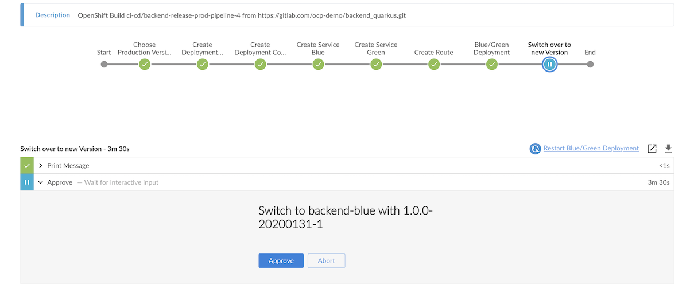

# CI/CD with Jenkins
```

   __________   ____________ 
  / ____/  _/ _/_/ ____/ __ \
 / /    / / _/_// /   / / / /
/ /____/ /_/_/ / /___/ /_/ / 
\____/___/_/   \____/_____/  
                             

```
<!-- TOC -->

- [CI/CD with Jenkins](#cicd-with-jenkins)
  - [Overview](#overview)
  - [Setup](#setup)
    - [Create Projects (Namespaces)](#create-projects-namespaces)
    - [Setup CI/CD Tools](#setup-cicd-tools)
    - [Setup Nexus](#setup-nexus)
    - [Create Pipeline](#create-pipeline)
  - [Jenkins Pipelines](#jenkins-pipelines)
    - [Build Pipeline](#build-pipeline)
    - [Release Staging Pipeline](#release-staging-pipeline)
    - [Release UAT Pipeline](#release-uat-pipeline)
    - [Production Pipeline](#production-pipeline)
  - [Run Pipelines](#run-pipelines)

<!-- /TOC -->

## Overview
Overview strategy to CI/CD pipelines as follow: 

* Jenkins and image registry stored in CI/CD project
* Deploy to Dev project (namespace) by reading source code from Git then build container,tagged with version specified in POM concat with build number and deploy to Dev project.
* Deploy to Staging project by provided drop-down menu to select container tag, then tag again with current date (YYYYMMDD) and build number, deploy to UAT Project. 
* Deploy to UAT project by provided drop-down menu to select container tag. This list will included only images those passed UAT only (contain date in tag)
* Deploy to Production by provided drop-down menu with blue/green deployment strategy.

<!-- Check for Jenkinsfile

* [Build](../Jenkinsfile/build/Jenkinsfile)
* [Release Staging](../Jenkinsfile/relese/Jenkinsfile)
* [Release UaT](../Jenkinsfile/release-uat/Jenkinsfile)
* [Production](../Jenkinsfile/relese-prod/Jenkinsfile) -->


<!-- Here -->

## Setup

### Create Projects (Namespaces)

This demo consists of 3 projects

* CI/CD (ci-cd) - for tools including Jenkins (master/slave), Nexus and Sonarqube. All container images are stored in this namesapce
* Development (dev) - for developer
* UAT (uat) - for UAT

OpenShift has security to isolate each project then we need to

* Allow project dev and uat to pull images from ci-cd
* Allow project ci-cd to managing dev and uat
  
Shell script [setup_projects.sh](../bin/setup_projects.sh) will do all above jobs.


### Setup CI/CD Tools

Shell script [setup_cicd.sh](../bin/setup_cicd.sh) is provided for

* Deploy Jenkins server
* Deploy Nexus and setup repoistory for container images, maven and nodejs
* Deploy SonarQube
* Create custom maven 3.6.3 with skopeo for Jenkins slave

Remark: You need to change default Nexus password. Instruction will be provided at end of shell script's output.

```bash
cd bin
#Create projects for dev,stage,uat and production
./setup_projects.sh

#Create project ci-cd, jenkins, nexus and sonarqube
./setup_ci_cd_tools.sh

#Create Jenkins slave with Maven 3.6 and Skopeo
./setup_maven36_slave.sh
```

### Setup Nexus
Login to nexus with user admin. Initial password is stored in bin/nexus_password.txt

  * Nexus password need to be matched with password in [nexus_settings.xml](../code/nexus_settings.xml)
  * Select enable anonymous access

### Create Pipeline

Create Build Pipeline on OpenShift

```bash
oc apply -f manifests/backend-build-pipeline.yaml -n ci-cd
oc apply -f manifests/backend-release-pipeline.yaml -n ci-cd
oc apply -f manifests/backend-release-uat-pipeline.yaml -n ci-cd
oc apply -f manifests/backend-release-prod-pipeline.yaml -n ci-cd
#or run following scripts in bin directory
./create_pipelines.sh
```

## Jenkins Pipelines
Pipelines details

|Pipelines|Description|Jenkinsfile Location
|---------|---------|---------|
|backend-build-pipeline|Use binary build to create container image, run Unit Test, SonarQube scan, archive JAR to nexus and deploy to Development project|[build/Jenkinsfile](../Jenkinsfile/build/Jenkinsfile)|
|backend-release-pipeline|Select image from image tag to deploy to Staging project,tag image with YYYYMMDD-<build number> and archive container image to Nexus|[release/Jenkinsfile](../Jenkinsfile/release/Jenkinsfile)|
|backend-release-uat-pipeline|Select image from image tag to deploy to UAT project. Only image with tag YYYYMMDD-<build number> can be selected|[release-uat/Jenkinsfile](../Jenkinsfile/release-uat/Jenkinsfile)|
|backend-release-prod-pipeline|Select image from image to deploy to production with blue/green deployment. Only image with tag YYYYMMDD-<build number> can be selected|[release-prod/Jenkinsfile](../Jenkinsfile/release-prod/Jenkinsfile)|

### Build Pipeline
* Checkout code from Git
* Build Uber JAR by using *[nexus_setting.xml](../code/nexus_settings.xml)* for load libaries from Nexus.
* Tag with X.Y.Z-build_number. Remark that version (X.Y.Z) is retrived from [pom.xml](../code/pom.xml)
* Parallel run Unit Test and scan code by SonarQube.
* Archive Uber JAR to Nexus.
* Create Build Config, Service and Route objects if not exists.
* Build container and store container image in OpenShift's internal registry inside ci-cd project
* Create Deployment Config. This will automatically deploy to dev project.

### Release Staging Pipeline
* Checkout code from Git
* Query OpenShift's internal image registry for backend container image and list only image tagged with version in format X.Y.Z
* Tag container image with format X.Y.Z-YYYYMMDD-build_number 
* Archive container image to Nexus
* Delete everythings related to backend app in staging project
* Create Service, Route and Deployment Config.

### Release UAT Pipeline
* Checkout code from Git
* Query OpenShift's internal image registry for backend container image and list only image already passed Staging that is tagged with version in format X.Y.Z-YYYYMMDD-build_number
* Delete everythings related to backend app in staging project
* Create Service, Route and Deployment Config.

### Production Pipeline
* Checkout code from Git
* Query OpenShift's internal image registry for backend container image and list only image already passed Staiging and UAT that is tagged with version in format X.Y.Z-YYYYMMDD-build_number
* Create Deployment Config for blue version and green version. (This will not automtically pods deployment)
* Create Service and Route for blue version and green version.
* Deploy to prod project with blue/green deployment
  - Check for active version
  - Deploy new version to inactive version
  - Prompt for switch to new version. This will be done by switch route to new version (currently inactive version)
  - Prompt to scaledown previously active version.

## Run Pipelines
Start pipeline via CLI with oc command
```bash
oc start-build backend-build-pipeline.yaml -n ci-cd
#Build start with build number

oc logs build/backend-build-pipeline-<build number> -n ci-cd
#Open URL show in log for open Jenkins

#Or run shellscript in bin directory
bin/start_build_pipeline.sh
```

Sample build pipeline result. Remark that Build Config already avaiable when this pipeline run then this step is skipped.

[Build Pipeline](imagesdir/build-pipeline.png)

Check that backend app pod is created in dev project with label version and tag.
```bash
oc get pods -n dev
oc get pod <pod name> -o yaml -n dev
```

Sample output from build number 19 with app version 1.0.0 (This is from pom.xml)
```yaml
labels:
    app: backend
    deployment: backend-1
    deploymentconfig: backend
    tag: 1.0.0-19
    version: 1.0.0
  name: backend-1-jsdhv
```

You can also use Develop Console to view backend app in Development project


Sample release (to staging environment) pipeline that prompt for user to select build to be release.


Sample Blue/Green Deployment for produciton environment pipeline that prompt for user to switch to newly deployment version



