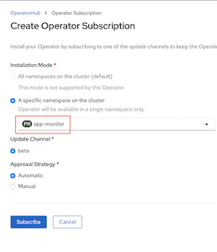
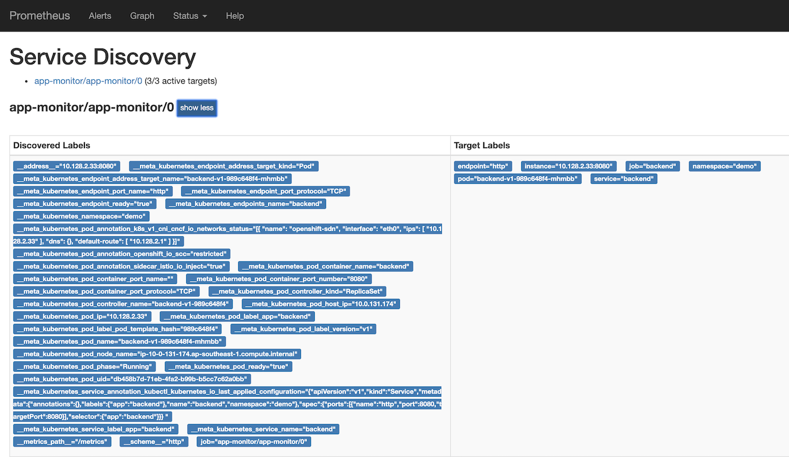
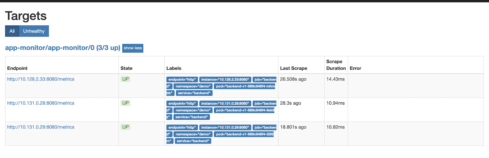
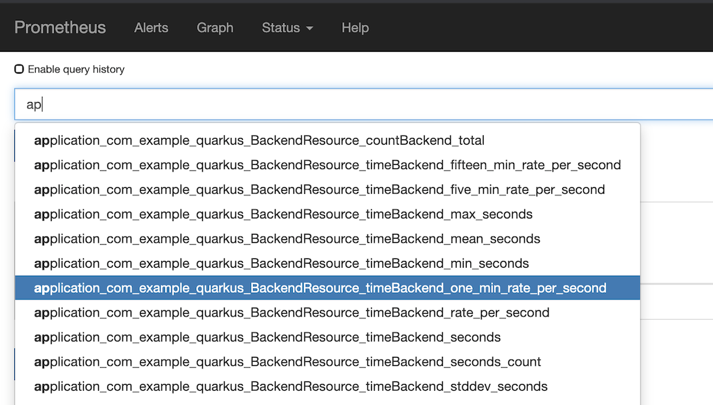
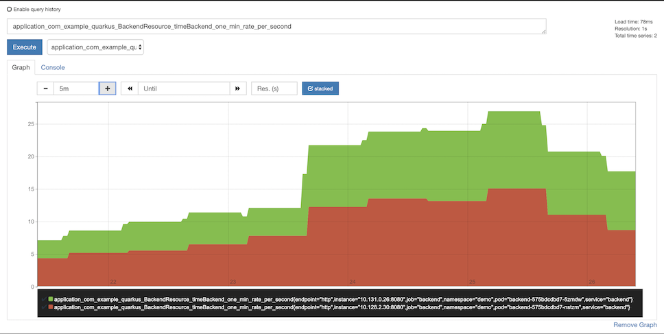
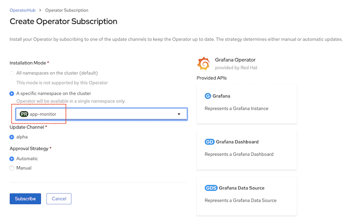
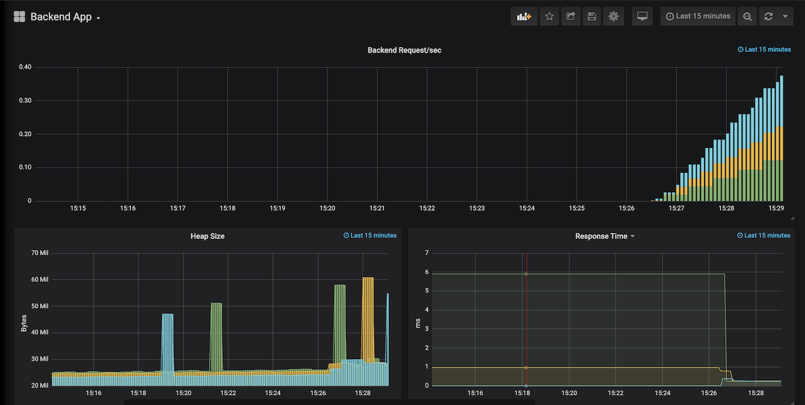

# Visualize Metrics Data

We will setup Prometheus to read metrics information from our Backend app and use Grafana to visualized these data.
```
______                         _   _                    
| ___ \                       | | | |                   
| |_/ / __ ___  _ __ ___   ___| |_| |__   ___ _   _ ___ 
|  __/ '__/ _ \| '_ ` _ \ / _ \ __| '_ \ / _ \ | | / __|
| |  | | | (_) | | | | | |  __/ |_| | | |  __/ |_| \__ \
\_|  |_|  \___/|_| |_| |_|\___|\__|_| |_|\___|\__,_|___/
                                                        
          _____            __                  
  ___    |  __ \          / _|                 
 ( _ )   | |  \/_ __ __ _| |_ __ _ _ __   __ _ 
 / _ \/\ | | __| '__/ _` |  _/ _` | '_ \ / _` |
| (_>  < | |_\ \ | | (_| | || (_| | | | | (_| |
 \___/\/  \____/_|  \__,_|_| \__,_|_| |_|\__,_|
                                               
```


<!-- TOC -->

- [Visualize Metrics Data](#visualize-metrics-data)
  - [Environment Preparation](#environment-preparation)
  - [Backend App Metrics data](#backend-app-metrics-data)
  - [Setup Prometheus](#setup-prometheus)
  - [Setup Grafana](#setup-grafana)

<!-- /TOC -->

## Environment Preparation

We will deploy backend application in project demo, Prometheus and Grafana in projct app-monitoring

* Create project demo for deploy Backend App
  
```bash
oc new-project demo --display-name="Demo"

#Deploy Backend
oc apply -f metrics/backend-deployment.yaml -n demo

#Create Service
oc apply -f metrics/backend-service.yaml -n demo

#Create Route
oc expose svc backend -n demo

#Check for backend pods
oc get pods -n demo

#Test Backen App
curl http://$(oc get route backend -n demo -o jsonpath#'{.spec.host}')
```
* Create project app-monitor for deploy Prometheus and Grafana

```bash
oc new-project app-monitor --display-name="Application Monitor"
```

## Backend App Metrics data

Our backend apps use microprofiles metrics along with annotation in code to exposes their statistics.  These can be acess via URI /metrics

You can test this with Backend app running on your local machine.

```bash
#Get all metrics
curl http://$(oc get route backend -n demo -o jsonpath='{.spec.host}')/metrics

#Get only app metrics
curl http://$(oc get route backend -n demo -o jsonpath='{.spec.host}')/metrics/application

#Get only app metrics in JSON format
curl -H "Accept: application/json" http://$(oc get route backend -n demo -o jsonpath='{.spec.host}')/metrics/application
```

## Setup Prometheus

* Install Prometheus Operator to project app-monitor by login to Administrator Console. Browse to Operator#>Operator Hub and search for Prometheus. Select namespace app-monitor


<!-- image::imagesdir/install-prometheus-operator.png[Prometheus Operator,40%,40%] -->

* Check that Prometheus operator is already installed on project app-monitor

```bash
oc get pods -n app-monitor
#Output
NAME                                   READY   STATUS    RESTARTS   AGE
prometheus-operator-849894cb8d-gdcd9   1/1     Running   0          111s
```

* Create Service Account, Service Monitor and Prometheus 

```bash
#Create Service Account, Service , Cluster Role and Cluster Role Binding
oc apply -f metrics/service_account.yaml -n app-monitor

#output
serviceaccount/prometheus created
service/prometheus created
clusterrole.rbac.authorization.k8s.io/prometheus created
clusterrolebinding.rbac.authorization.k8s.io/prometheus created

#Create Service Monitor
oc apply -f metrics/service_monitor.yaml -n app-monitor
#output
servicemonitor.monitoring.coreos.com/app-monitor created

#Create Prometheus by apply CRDs
oc apply -f metrics/prometheus.yaml -n app-monitor
#output
prometheus.monitoring.coreos.com/prometheus created

#Check that prometheus is up and running
oc get pods -n app-monitor
#Output
NAME                                   READY   STATUS    RESTARTS   AGE
prometheus-operator-849894cb8d-gdcd9   1/1     Running   0          4m17s
prometheus-prometheus-0                3/3     Running   1          97s
prometheus-prometheus-1                3/3     Running   1          97s
```

* Take a look at [service_monitor.yaml](../metrics/service_monitor.yaml)

```yaml
apiVersion: monitoring.coreos.com/v1
kind: ServiceMonitor
metadata:
  name: app-monitor
  labels:
    k8s-app: app-monitor
  #Deploy in namespace app-monitor
  namespace: app-monitor
spec:
  namespaceSelector:
    #Read data from namespace demo
    matchNames:
      - demo
  selector:
    matchLabels:
      #Read data from service with label app eqauls to backend
      #Service need label app = bakend  not Pod!!
      app: backend
  endpoints:
    - interval: 30s
      #Read data from URI /metrics
      path: /metrics
      #Port name need to be **matched** with **name** of port in service to be monitored 
      port: http
```

* Create route for Prometheus

```bash
oc create route edge prometheus --service=prometheus --port=9090 -n app-monitor
#Output
route.route.openshift.io/prometheus created

#Get Route URL
echo "https://$(oc get route prometheus -n app-monitor -o jsonpath='{.spec.host}')"
```


* Check Service Discovery status by browser to Status #> Service Discovery and click "show more" to display more details



* Check Target by browser to Status, Targets and click "show more" to display more details.



* Click Graph. Then input query. (Prometheus provide type ahead functionality). Select one of application query. e.g. timeBackend_one_min_rate_per_second. Then click "Execute" and "Graph"



* With some load to bakend app. Promethus will display you graph.



## Setup Grafana

* Install Grafanaheus Operator to project app-monitor by login to Administrator Console. Browse to Operator#>Operator Hub and search for Grafana. Select namespace app-monitor



* Check that Grafana operator is already installed on project app-monitor

```bash
oc get pods -n app-monitor
#Output
NAME                                   READY   STATUS    RESTARTS   AGE
grafana-operator-7cfc8fd6c8-tp7bq      1/1     Running   0          21s
prometheus-operator-849894cb8d-gdcd9   1/1     Running   0          27m
prometheus-prometheus-0                3/3     Running   1          24m
prometheus-prometheus-1                3/3     Running   1          24m

```

* Create DataSource, Grafana and Dashboard

```bash
oc apply -f metrics/grafana_datasource.yaml -n app-monitor
#Output
grafanadatasource.integreatly.org/grafana-datasource created

oc apply -f metrics/grafana.yaml -n app-monitor
#Output
grafana.integreatly.org/grafana created

oc apply -f metrics/grafana_dashboard.yaml -n app-monitor
#Output
grafanadashboard.integreatly.org/backend-dashboard created

#Check for Grafana pod
oc get pods -n app-monitor
#Output
NAME                                   READY   STATUS    RESTARTS   AGE
grafana-deployment-6fdb56d687-6p7w7    1/1     Running   0          75s
grafana-operator-7cfc8fd6c8-tp7bq      1/1     Running   0          2m50s
prometheus-operator-849894cb8d-gdcd9   1/1     Running   0          29m
prometheus-prometheus-0                3/3     Running   1          27m
prometheus-prometheus-1                3/3     Running   1          27m

```

* Login to Grafana. Check for URL by using following command

```bash
echo "https://$(oc get route grafana-route -n app-monitor -o jsonpath='{.spec.host}')"
```

* Login to Grafana with default user and password (Check user and password in [grafana.yaml](../metrics/grafana.yaml)

* Check for Grafana Dashboard. After login, click Home#>Backend App




