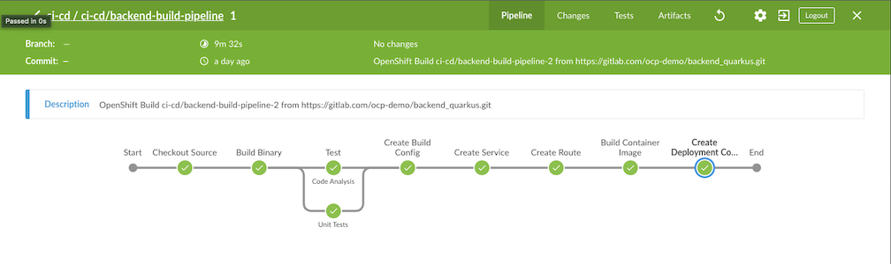

= CI/CD with Jenkins

:toc:

== Create OpenShift Project, Jenkins, Nexus and SonarQube

Run following script in directory bin

[source,bash]
----
cd bin
# Create project ci-cd, jenkins, nexus and sonarqube
./setup_ci_cd_tools.sh
# Create Jenkins slave with Maven 3.6 and Skopeo
./setup_maven36_slave.sh
# Create projects for dev,stage,uat and production
./setup_projects.sh
----

After run setup_ci_cd_tools.sh, You need to record nexus password then login to nexus and set nexus to allow anonymous access.

== Jenkins Pipelines
Create pipelines in ci-cd project with oc command

[source,bash]
----
oc apply -f manifests/backend-build-pipeline.yaml -n ci-cd
oc apply -f manifests/backend-release-pipeline.yaml -n ci-cd
oc apply -f manifests/backend-release-uat-pipeline.yaml -n ci-cd
oc apply -f manifests/backend-release-prod-pipeline.yaml -n ci-cd
----

or run following bash script to create all pipelines

[source,bash]
----
cd bin
./create_pipelines.sh
----

Pipelines details
All templates are in directory link:../manifests[manifests]

[options=header]
|===
|Pipelines|Description|Jenkinsfile Location
|backend-build-pipeline|Use S2I to create container image, run Unit Test, SonarQube scan, archive JAR to nexus and deploy to Development project|link:../build/Jenkinsfile[build/Jenkinsfile]
|backend-release-pipeline|Select image from image tag to deploy to Staging project,tag image with YYYYMMDD-<build number> and archive container image to Nexus|link:../release/Jenkinsfile[release/Jenkinsfile]
|backend-release-uat-pipeline|Select image from image tag to deploy to UAT project. Only image with tag YYYYMMDD-<build number> can be selected|link:../release-uat/Jenkinsfile[release-uat/Jenkinsfile]
|backend-release-prod-pipeline|Select image from image to deploy to production with blue/green deployment. Only image with tag YYYYMMDD-<build number> can be selected|link:../release-prod/Jenkinsfile[release-prod/Jenkinsfile]
|===

Start pipeline via CLI by oc command
[source,bash]
----
oc start-build backend-build-pipeline.yaml -n ci-cd
oc logs build/backend-build-pipeline-<build number> -n ci-cd
# Open URL show in log for open Jenkins
----

Sample build pipeline result. Remark that Build Config already avaiable when this pipeline run then this step is skipped.

Check that backend app pod is created in dev project with label version and tag.
[source,bash]
----
oc get pods -n dev
oc get pod <pod name> -o yaml -n dev
----

Sample output from build number 19 with app version 1.0.0 (This is from pom.xml)
[source,bash]
----
...
labels:
    app: backend
    deployment: backend-1
    deploymentconfig: backend
    tag: 1.0.0-19
    version: 1.0.0
  name: backend-1-jsdhv
...
----

You can also use Develop Console to view backend app in Development project

image::imagesdir/dev-console-dev-project.png[]

Sample release (to staging environment) pipeline that prompt for user to select build to be release.

image::imagesdir/release-pipeline.png[]

Sample Blue/Green Deployment for produciton environment pipeline that prompt for user to switch to newly deployment version

image::imagesdir/blue-green-switch-pipeline[]
